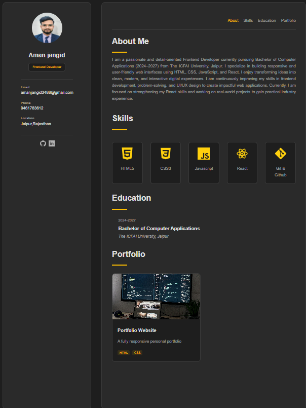

# Aman Jangid - Portfolio Website

Welcome to my personal portfolio website
This project showcases my skills, projects, and experience as a Full Stack Developer.

---

## Live Demo
🔗 https://codewithaman-dev.github.io/portfolio-website/

---

## About Me
I am a passionate Full Stack Developer focused on building modern, responsive, and user-friendly web applications.

-  Strong in Frontend & Backend Development
-  Currently learning MERN Stack
-  Practicing Data Structures & Algorithms
-  Goal: Become a Software Engineer

---

## 🛠 Tech Stack Used

- HTML5
- CSS3
- Responsive Design
- Git & GitHub

---

## Features

- Fully Responsive Design
- Clean and Modern UI
- Smooth Scrolling
- Mobile Friendly Layout
- Professional Developer Theme

---

## Project Structure
-portfolio-website/
│
├── index.html
├── style.css

---

##  Screenshots

##  Preview

---

## Connect With Me

-  LinkedIn: https://www.linkedin.com/in/aman-jangid-3b2796327
-  Email: amanjangid3488@gmail.com

---

##  Show Your Support

If you like this project, please give it a on GitHub!
